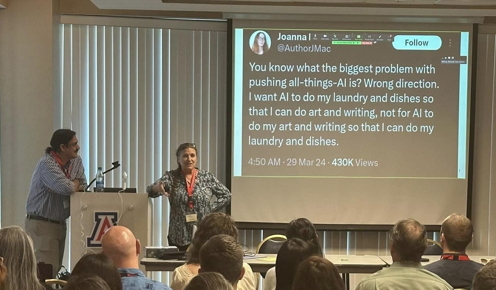

## Publications

Thue, Braden, Sydney Bess Greenspun, Rolando Coto-Solano, Amy Fountain, Michael Gallaspy, Gus Hahn Powell, Michael Hammond, John Ivens, Eric Jackson, Sevren Quijada, and Aresta Tsosie Paddock. To Appear. Introducing AILT: Advancing Indigenous Language Technologies. Coyote Papers.

## Presentations

Fountain, Amy, Jennifer Medina, Michael Hammond, Gus Hahn-Powell, Eric Jackson, Youmi Ji, Alice Saeborn Kwak, Ross Freeman, Braden Thue, Sydney Bess Greenspun, Jake Mains, Michael Gallaspy, John Ivens, Aresta Tsosie-Paddock and Rolando Coto Solano. 2026. Improving language technology with Indigenous language communities.  Linguistic Society of America Annual Meeting. [Poster](https://drive.google.com/file/d/1N-jXtTvlmG063ZCTvkQemx24_OfVhoW2/view?usp=sharing){.external-link target=_blank}

Lopez, Monte, Sierra Ward, Rolando Coto-Solano and Amy Fountain. 2026. ASR for Transcription for Language Departments.  Linguistic Society of America Annual Meeting. [LEXING Talk] *get link*.

Thue, Braden and Michael Gallaspy. 2026. An orthography conversion tool for Dakota. Linguistic Society of America Annual Meeting. [LEXING Talk] *get link*.

Thue, Braden, Sydney Bess Greenspun, Rolando Coto-Solano, Amy Fountain, Michael Gallaspy, Gus Hahn Powell, Michael Hammond, John Ivens, Eric Jackson, Sevren Quijada, and Aresta Tsosie Paddock. 2025. Introducing AILT: Advancing Indigenous Language Technologies. Arizona Linguistics Circle [TALK](https://arizona.hosted.panopto.com/Panopto/Pages/Embed.aspx?id=21587fa9-cdb2-405b-98d6-b3a101609096&autoplay=false&offerviewer=true&showtitle=false&showbrand=false&captions=true&interactivity=all){.external-link target=_blank}

Tsosie-Paddock, Aresta, Ross Freeman and Amy Fountain. 2026. Our Aha! moment: No wonder language workers are annoyed by keyboards. Linguistic Society of America Annual Meeting. [LEXING Talk] *get link*

## Workshops

## Acknowledgments

  
  
  
  

We are grateful for financial support from the [Agnese Helms Haury Program in Environment and Social Justice](/){.external-link target=_blank} Award through the University of Arizona [College of Social and Behavioral Sciences](https://sbs.arizona.edu){.external-link target=_blank} and the [National Science Foundation](https://nsf.gov){.external-link target=_blank} Award BCS-2347147.  Our project is housed at [The University of Arizona](https://arizona.edu){.external-link target="_blank"} and [Dartmouth University](https://dartmouth.edu){.external-link target="_blank"}.