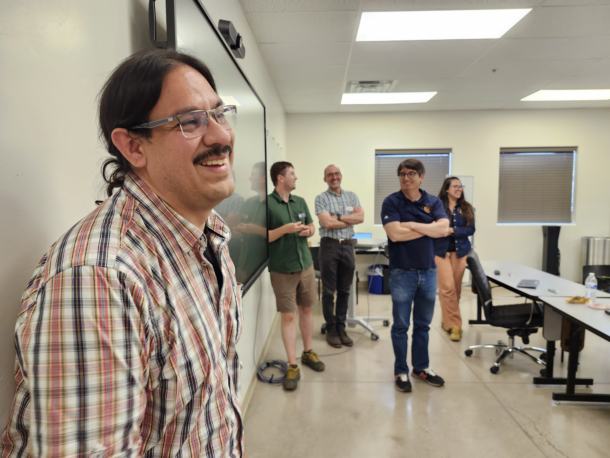
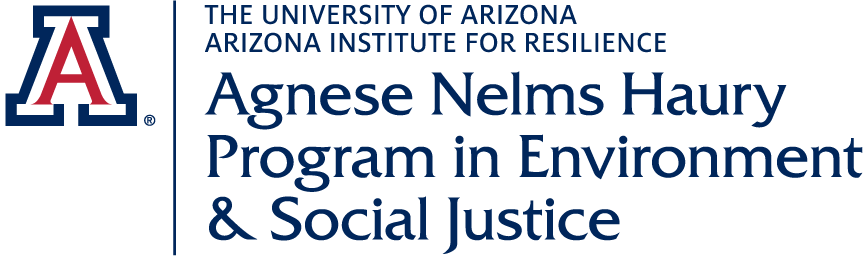
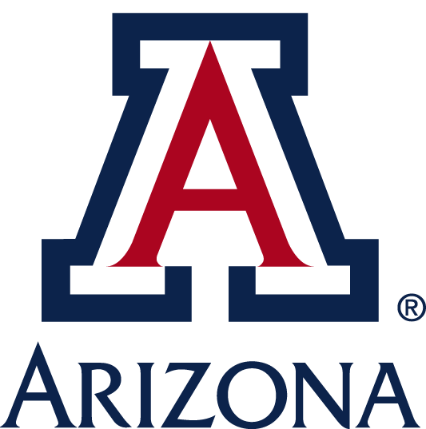
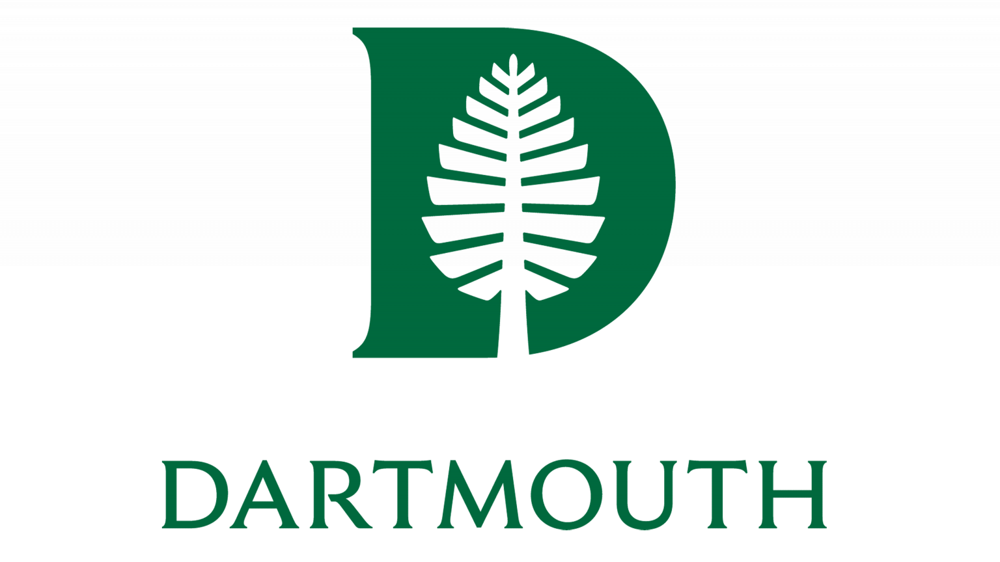

## Publications

Thue, Braden, Sydney Bess Greenspun, Rolando Coto-Solano, Amy Fountain, Michael Gallaspy, Gus Hahn-Powell, Michael Hammond, John Ivens, Eric Jackson, Sevren Quijada, and Aresta Tsosie-Paddock. 2025. Introducing AILT: Advancing Indigenous Language Technologies. Coyote Papers. [Article](https://drive.google.com/file/d/1McD79H__SmldaS1LUq2LENR37QxdqqIQ/view?usp=drive_link){.external-link target=_blank}

## Presentations

Cummings, Craig. 2025.  Adding human languages to computers and mobile devices.  AILT Presentation, September 23 [Talk](https://arizona.hosted.panopto.com/Panopto/Pages/Viewer.aspx?id=1735247e-84fd-4ec6-a76d-b36301771a0b){.external-link target=_blank}

Fountain, Amy, Jennifer Medina, Michael Hammond, Gus Hahn-Powell, Eric Jackson, Youmi Ji, Alice Saeborn Kwak, Ross Freeman, Braden Thue, Sydney Bess Greenspun, Jake Mains, Michael Gallaspy, John Ivens, Aresta Tsosie-Paddock and Rolando Coto-Solano. 2026. Improving language technology with Indigenous language communities.  Linguistic Society of America Annual Meeting. [Poster](https://drive.google.com/file/d/1N-jXtTvlmG063ZCTvkQemx24_OfVhoW2/view?usp=sharing){.external-link target=_blank}

Fountain, Amy. 2026. A view on AI & Indigenous Languages from the Advancing Indigenous Language Technologies Working Group. Sunaŵi AI & Indigenous Language Revitalization Workshop. Loyola Marymount University, June 8-11. [Talk](https://drive.google.com/file/d/1q29p15-88qPDe8Uqi9NPkt71Dwqlfw0S/view?usp=sharing){.external-link target=_blank}

Fountain, Amy. 2026.  A quick and dirty guide to language documentation with technology: a view from AILT.  Trails Talk, provided for the Northwest Indigenous Language Institute meetings on July 23. [Talk](https://drive.google.com/file/d/1VaTxFvlrBRmGS6g8kiPbL0R5SajCdsal/view?usp=drive_link){.external-link target=_blank}

Fountain, Amy. 2026. Invited Panel on Indigenous Languages and Ethics, Computer Assisted Language Instruction Consortium (Calico).  Miami University of Ohio, July 9. [Talk](https://drive.google.com/file/d/1JCNaUEjjaTo69QRvJWmFcR2_uh-azN1p/view?usp=sharing){.external-link target=_blank}  

Fountain, Amy, Rolando Coto-Solano, Eric Jackson, Michael Hammond, Gus Hahn-Powell, Monte López, Sierra Ward, and Youmi Ji. 2026. ASR for Transcription for Language Departments.  Linguistic Society of America Annual Meeting. [LEXING Talk](https://drive.google.com/file/d/1ncyRqVaVA19eOH2OmPOHJs3K8KtyDRhI/view?usp=drive_link){.external-link target=_blank}

Thue, Braden and Michael Gallaspy. 2026. An orthography conversion tool for Dakota. Linguistic Society of America Annual Meeting. [LEXING Talk]

Thue, Braden, Sydney Bess Greenspun, Rolando Coto-Solano, Amy Fountain, Michael Gallaspy, Gus Hahn-Powell, Michael Hammond, John Ivens, Eric Jackson, Sevren Quijada, and Aresta Tsosie-Paddock. 2025. Introducing AILT: Advancing Indigenous Language Technologies. Arizona Linguistics Circle [Talk](https://arizona.hosted.panopto.com/Panopto/Pages/Embed.aspx?id=21587fa9-cdb2-405b-98d6-b3a101609096&autoplay=false&offerviewer=true&showtitle=false&showbrand=false&captions=true&interactivity=all){.external-link target=_blank}

Tsosie-Paddock, Aresta, Amy Fountain, and Ross Freeman. 2026. Our Aha! moment: No wonder language workers are annoyed by keyboards. Linguistic Society of America Annual Meeting. [LEXING Talk](https://drive.google.com/file/d/1Mj9PgpmWOhsCqmGEaSYWvZaceA_FxIke/view?usp=drive_link){.external-link target=_blank}

## Workshops
Coto-Solano, Rolando, Amy Fountain, Michael Hammond, Gus Hahn-Powell, John Ivens, Eric Jackson, Alice Saeborn Kwak and Aresta Tsosie-Paddock. 2024. Community Conversations to kick off AILT project.  Participants included representatives of Anishinaabe (Ojibwa), Aymara, Chatina, Gila River Indian Community, Hollow Water First Nation Manitoba, Montreal Lake Cree Nation, Nishnaabemwin, O'odham Ñi'okǐ Ki:, Ojibwe, Salt River Pima Maricopa Indian Communities, Turtle Mountain Community College; with invited guest Mary Johnson of the American Indian Higher Education Consortium, as part of the Symposium on American Indian Languages. [Notes](https://drive.google.com/file/d/1EuYtpB2fYvMKudpxeaSmcA6Krbi902V4/view?usp=drive_link){.external-link target=_blank}

Coto-Solano, Rolando, assisted by Eric Jackson, Gus Hahn-Powell, Michael Hammond, Michael Gallaspy, John Ivens and Amy Fountain. 2025. ASR for Language Departments. With O'odham Ñi'okǐ Ki: and Salt River Pima Maricopa Indian Communities in five day-long lessons at Tohono O'odham Community College. 

Coto-Solano, Rolando. 2024a. Speech Recognition and Indigenous Languages.  Workshop at CoLang.  Arizona State University.

Coto-Solano, Rolando. 2024b. Natural Language Processing for Indigenous Languages.  Workshop at CoLang.  Arizona State University.

Coto-Solano, Rolando and Gabriela de la Cruz Sánchez. 2026. Automatic Transcription of Indigenous Languages.  Workshop at CoLang.  University of Nevada, Reno.

de la Cruz Sánchez, Gabriela and Eric Jackson. 2024. Introduction to FLEx 1 and 2. Workshop at CoLang.  Arizona State University.

Freeman, Ross, Aresta Tsosie-Paddock, John Ivens and Amy Fountain. 2024. Keyboard development with Keyman Developer. With Salt River Pima Maricopa Indian Communities in one day-long lesson; Introduction to Diné Bizaad classes (LING104b and LING204b) in one class period at the University of Arizona.  

Gallaspy, Michael and Mark Simmons. 2026.  Automatic Morphological Parsing.  Workshop at CoLang.  University of Nevada, Reno.

Hahn-Powell, Gus, John Ivens and Amy Fountain. 2024. Basics of database design and implementation. Workshop at CoLang.  Arizona State University.

Jackson, Eric, assisted by John Ivens, Gus Hahn-Powell, Braden Thue, and Amy Fountain. 2025. Introduction to FLEx.  Three day-long lessons; with Salt River Pima Maricopa Indian Communities.

Ivens, John, Amy Fountain, Gus Hahn-Powell and Amy Fountain. 2025.  Introduction to database design, one day-long lesson; with Salt River Pima Maricopa Indian Communities.

## Courses

LING424/524, Methods and Ethics in Linguistics:  Language Technology for Data Sovereignty.  Offered at AILDI's 2026 Summer Institute, Gus Hahn-Powell and Amy Fountain, instructors. [Syllabus](https://drive.google.com/file/d/1Ds09BJzZeOmpt4nMU2hXnY1f21EILzcc/view?usp=drive_link){.external-link target=_blank}

## Acknowledgments

  
  
  
  

We are grateful for financial support from the [Agnese Helms Haury Program in Environment and Social Justice](/){.external-link target=_blank} Award through the University of Arizona [College of Social and Behavioral Sciences](https://sbs.arizona.edu){.external-link target=_blank} and the [National Science Foundation](https://nsf.gov){.external-link target=_blank} Award BCS-2347147.  Our project is housed at [The University of Arizona](https://arizona.edu){.external-link target="_blank"} and [Dartmouth University](https://dartmouth.edu){.external-link target="_blank"}.