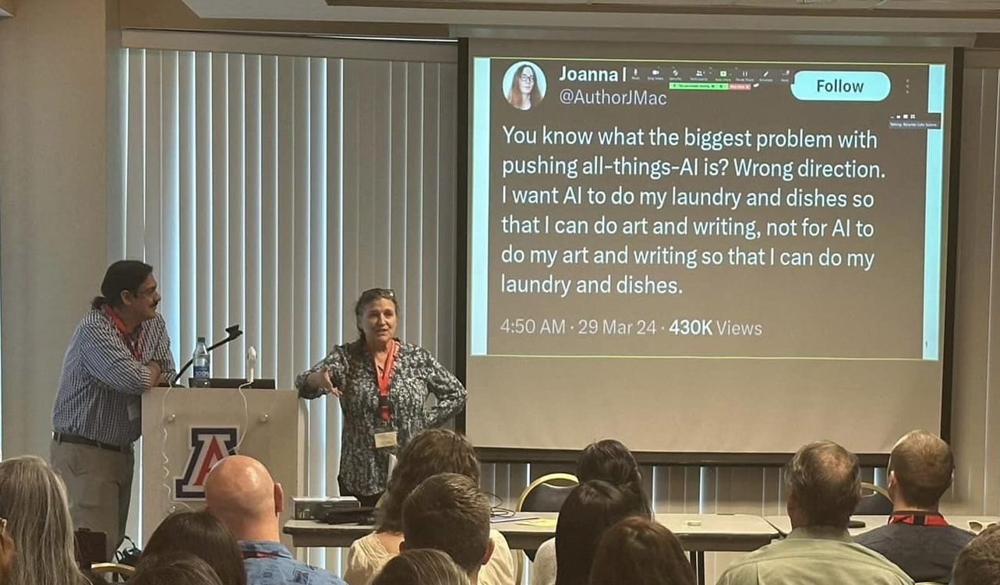

If you're interested in working with us in any capacity, we'd love to hear from you!

## Contact Us

Please contact [Amy](mailto:avf@arizona.edu), or anyone on [the team](./team.md){.internal-link} for more information, and/or

- [Suggest a course, workshop or training](https://forms.gle/n7kht1euBYcsUA3j8){.internal-link}
- [Suggest or endorse a tool](https://forms.gle/piYc85kzFSP9bZV5A){.internal-link}
- [Join us!](https://forms.gle/CB73EGYLr6nSHQVk6){.internal-link}

## Get in the Loop

If you'd like to be kept in the loop on AILT activities, we have a listserv at **ling-ailt@arizona.edu** and you are welcome to join! Just send your details [here](https://forms.gle/CB73EGYLr6nSHQVk6){.internal-link}.

## FYI

If you're interested in Indigenous Language Technologies generally, we highly recommend you join the mailing list administered by Dr. Phil Cash Cash, called 'Indigenous Languages and Technologies'.  Info and instructions [here](http://www.u.arizona.edu/~cashcash/ILAT.html){.external-link target="_blank"}.  We are not officially affiliated with ILAT, but ILAT is great!

## Acknowledgments

  
  
  
  

We are grateful for financial support from the [Agnese Helms Haury Program in Environment and Social Justice](/){.external-link target=_blank} Award through the University of Arizona [College of Social and Behavioral Sciences](https://sbs.arizona.edu){.external-link target=_blank} and the [National Science Foundation](https://nsf.gov){.external-link target=_blank} Award BCS-2347147.  Our project is housed at [The University of Arizona](https://arizona.edu){.external-link target="_blank"} and [Dartmouth University](https://dartmouth.edu){.external-link target="_blank"}.

