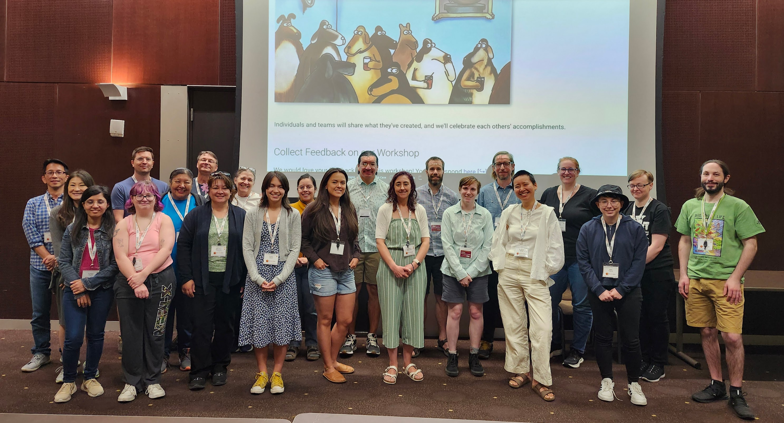

One of our goals is to develop courses, workshops and trainings that can be easily accessed and used by community language workers and interested others.

  

## Available Now

Currently under development, but available for use is [Introduction to Database Design](https://ailt.arizona.edu/courses/intro-to-databases/){.internal-link target="_blank"}.  We are working to transform this material into a more clearly organized self-directed, asynchromous, online course - but there are useful lessons here for those who wish to try them.

We offered a portion of this material as a four-day workshop at [CoLang2024](https://www.colang2024.org/){.external-link target="_blank"} titled [Basics of Database Design](https://ailt.arizona.edu/courses/intro-to-databases/colang/){.internal-link target="_blank"}.

We have developed in-person workshops in a variety of other topics, please [contact us](./contact.md){.internal-link}!

- **FLEx I and II** use of FLEx software for dictionary-making and conducting textual analysis (Eric Jackson)

- **Natural Language Processing for Indigenous Languages**: applying deep learning tools to language documentation and revitalization (Rolando Coto-Solano)

- **Speech Recognition for Indigenous Languages**: developing automatic speech recognition systems for language documentation (Rolando Coto-Solano)

## Requested but not yet available

We have so far received and are triaging the following workshop requests:

- **Language Technology development with Indigenous Communities**. Training for technology specialists on principles and practices of language technology development with Indigenous communities. Potentially resulting in some kind of badge or certificate.

## Suggest a course, workshop or training!

Complete this [short form](https://forms.gle/n7kht1euBYcsUA3j8){.internal-link} and we'll respond to your suggestion as soon as we're able.

## Acknowledgments

  
  
  
  

We are grateful for financial support from the [Agnese Helms Haury Program in Environment and Social Justice](/){.external-link target=_blank} Award through the University of Arizona [College of Social and Behavioral Sciences](https://sbs.arizona.edu){.external-link target=_blank} and the [National Science Foundation](https://nsf.gov){.external-link target=_blank} Award BCS-2347147.  Our project is housed at [The University of Arizona](https://arizona.edu){.external-link target="_blank"} and [Dartmouth University](https://dartmouth.edu){.external-link target="_blank"}.

