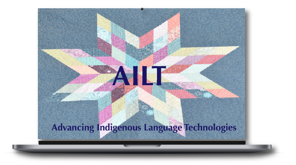
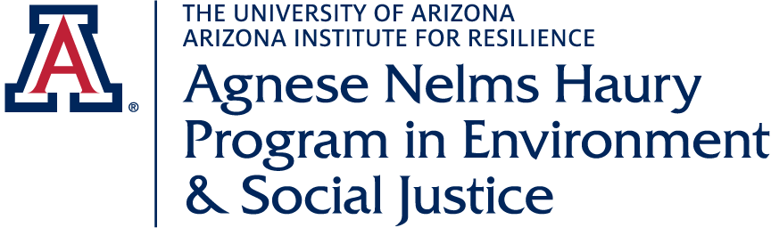
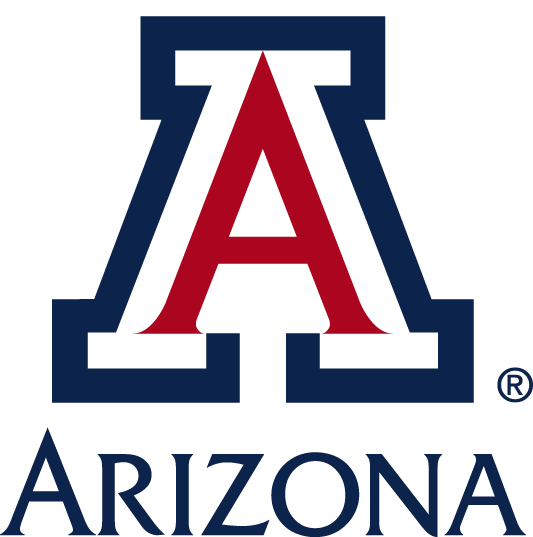
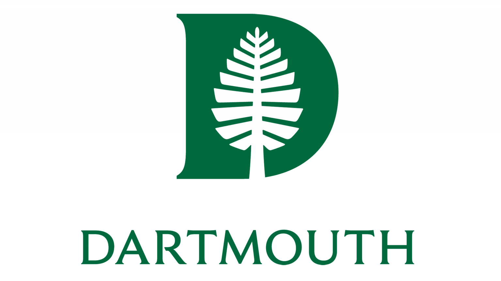

  

The **Advancing Indigenous Language Technologies** (AILT) Working Group is coalition of academic and community language workers and scholars joining efforts to support the advancement of language technologies that serve Indigenous language community needs.
AILT was launched in the summer of 2023 as a collaboration among three academic programs affiliated with the [University of Arizona Department of Linguistics](https://linguistics.arizona.edu), [College of Education](https://coe.arizona.edu), and [Department of American Indian Studies](https://ais.arizona.edu):

- [the American Indian Language Development Institute](https://aildi.arizona.edu) (AILDI)
- [the Master’s in Native American Languages and Linguistics](https://linguistics.arizona.edu/ma-native-american-languages-linguistics) (NAMA)
- [the Human Language Technologies Program](https://hlt.arizona.edu) (HLT)

## Our Guiding Principles 

AILT works to support language technology development that 

- meets community needs, 
- aligns with community values, and 
- respects communities’ rights to data sovereignty.

## Our Goals 

The goals of the AILT Working Group are to support and facilitate development of Indigenous language technologies as an enduring partner with community language workers by, for example:

-	Collaboratively developing, testing, and deploying software, technological infrastructure, and technology development best practices for Indigenous Language Communities in community-based language documentation and revitalization programs;
-	Furthering key partnerships with Native American Tribes and Tribal Colleges and Universities, focusing on those who wish to collaborate with us, in supporting course and curriculum development for capacity building within communities in the area of Indigenous Language Technologies; and
-	Establishing new courses, workshops, partnerships, and programs to support the training of Indigenous community members and others who wish to engage in language technology development, both at our Universities and in their communities.

We expect these goals to evolve and change as we build and maintain communication and support networks including Indigenous language communities, academic scholars, IT professionals, and other interested participants.

## Our Focus

Language Technologies includes, but is not limited to:
 - **digital resource development**, for example, the creation and maintenance of specialized keyboards, databases and repositories, web and/or phone applications; and
 - **natural language processing**, for example, the use of machine learning to create speech-to-text systems to facilitate transcription of audio-video materials, machine translation projects, input tools with predictive text, spellcheckers, and the like.

## Interested?

 [Contact us](./contact.md){.internal-link} for more information about AILT!

---

## This Site

**Documentation**: <a href="https://arizona-linguistics.github.io/ailt" target="_blank">https://arizona-linguistics.github.io/ailt</a>

**Source Code**: <a href="https://github.com/arizona-linguistics/ailt" target="_blank">https://github.com/arizona-linguistics/ailt</a>

## License

This project is made available under the terms of [CC BY-SA 4.0](https://creativecommons.org/licenses/by-sa/4.0/).

---

## Acknowledgments

  
  
  
  

We are grateful for financial support from the [Agnese Helms Haury Program in Environment and Social Justice](/){.external-link target=_blank} Award through the University of Arizona [College of Social and Behavioral Sciences](https://sbs.arizona.edu){.external-link target=_blank} and the [National Science Foundation](https://nsf.gov){.external-link target=_blank} Award BCS-2347147.  Our project is housed at [The University of Arizona](https://arizona.edu){.external-link target="_blank"} and [Dartmouth University](https://dartmouth.edu){.external-link target="_blank"}.
