The AILT working group invites participation from communities, academic scholars, and interested others.

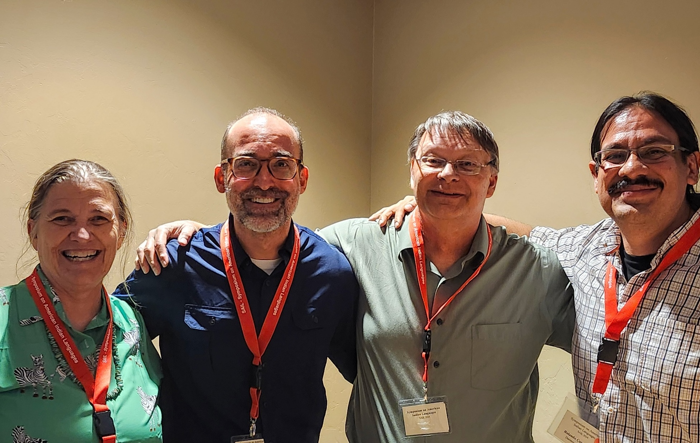

## Community Partners

Coming soon!

If you would like to get involved, [please reach out](mailto:avf@arizona.edu).

## Community Consultation

Our community consultation process was launched at [SAIL2024](https://sites.google.com/view/sail2024/home){.external-link target="_blank"}.  We countinued the work at [CoLang2024](https://www.colang2024.org/){.external-link target="_blank"}. If you'd like to get involved [contact us](./contact.md){internal-link}, we'd look forward to the opportunity to consult with you and your community!

**AILT Community Conversation Participants from SAIL2024**, please contact [Amy](mailto:avf@arizona.edu) to access our notes and plans from that session, or if you or your community would like to be listed here!  **CoLang Friends**, please contact [Amy](mailto:avf@arizona.edu) if you or your community would like to be listed here!

## Participating Academic Programs

    <a href="https://aildi.arizona.edu">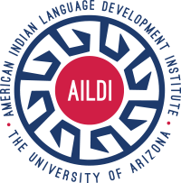</a> 
    <a href="https://linguistics.arizona.edu/ma-native-american-languages-linguistics">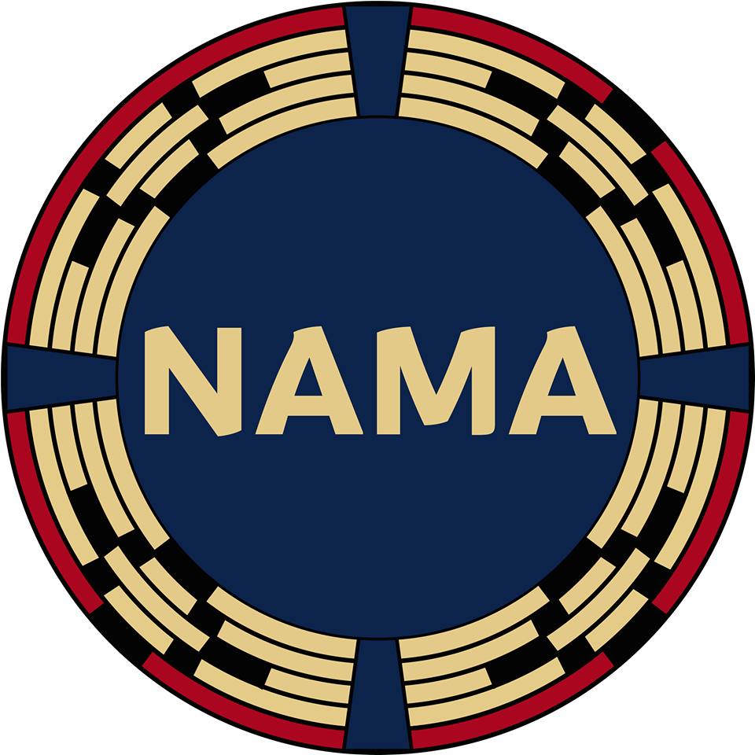
    <a href="https://linguistics.arizona.edu/ms-hlt">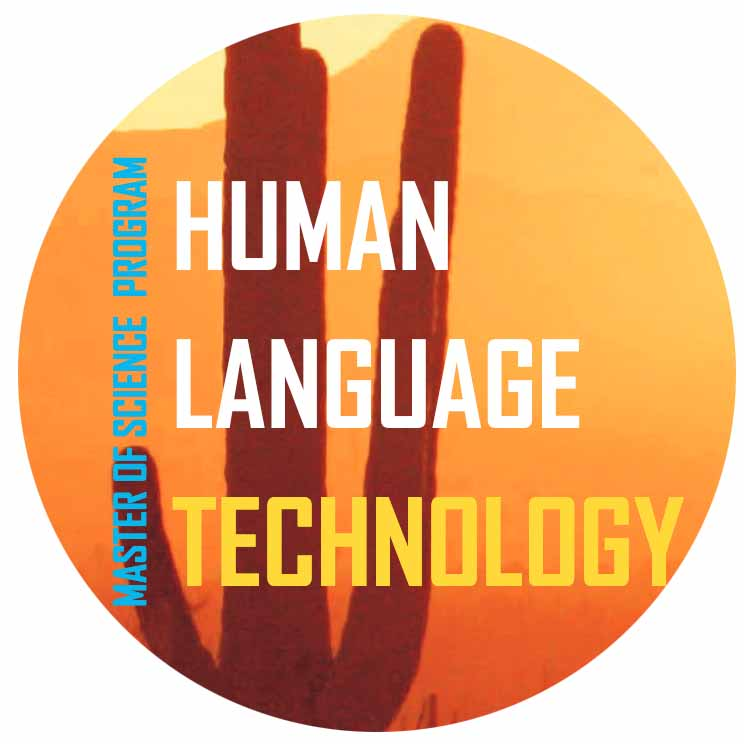

- [AILDI](https://aildi.arizona.edu){.external-link target=_blank} The American Indian Language Development Institute. 
- [NAMA](https://linguistics.arizona.edu/ma-native-american-languages-linguistics){.external-link target=_blank} M.A. in  Native American Languages & Linguistics, University of Arizona. 
- [HLT](https://linguistics.arizona.edu/ms-hlt){.external-link target=_blank} The Human Language Technologies Program (online), University of Arizona. 

## Core Team

We began this project in Summer 2023 at the University of Arizona, with the idea to bring together expertise in language revitalization and reclamation with that in human language technologies. Our current core group members include:

### Amy Fountain

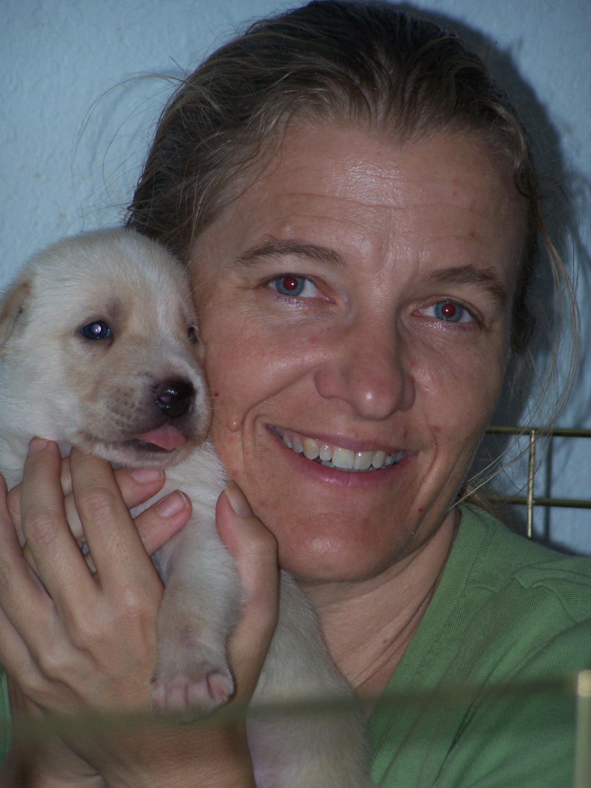

[Associate Professor of Practice, Linguistics, University of Arizona](https://linguistics.arizona.edu/person/amy-fountain){.external-link target=_blank}.  Amy is the convenor of the the AILT Working group.  She teaches mostly undergraduate courses, and works to support the goals of [the American Indian Language Development Institute](https://aildi.arizona.edu){.external-link target=_blank}.  She has been working on a [language technology development project](https://thecolrc.org){.external-link target=_blank} with the Coeur d'Alene Language Programs for more than 15 years.

### Aresta Tsosie Paddock

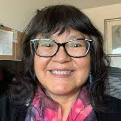

[Assistant Professor, American Indian Studies and Linguistics, University of Arizona](https://naair.arizona.edu/person/aresta-tsosie-paddock){.external-link target=_blank}. Aresta (Diné, Navajo Nation) investigates displacement and dispossession of cultural heritage, Navajo language, native gender, Navajo history and philosophy, native nation building, Indigenous urban studies, revitalizating & reclaiming language, tribal government, and Federal Indian law and policy.

### Eric Jackson

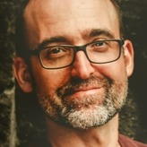

[Assistant Professor of Practice, Linguistics, University of Arizona](https://linguistics.arizona.edu/person/eric-jackson){.external-link target=_blank}. Eric is an instructor in the UA Masters in Human Language Technology program. His experience includes many years working together with language community members to develop language-related infrastructure. His goal is to bring the kind of technology tools that have been developed for languages like English, to languages and communities that do not yet have them. 

### Gus Hahn-Powell

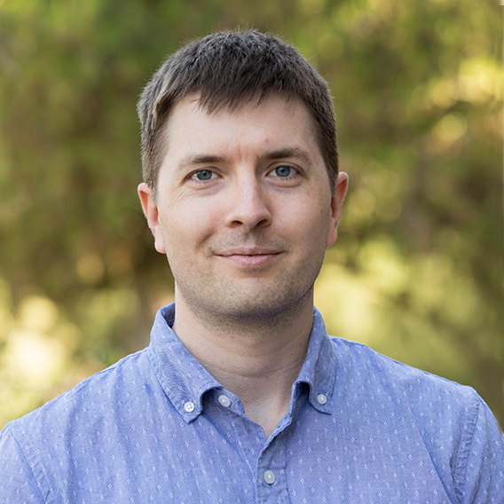

[Assistant Professor, Linguistics, University of Arizona](https://linguistics.arizona.edu/person/gus-hahn-powell){.external-link target=_blank}. [Gus](https://parsertongue.org/about) is a core contributor to [numerous information extraction and knowledge assembly systems](https://kiglobalhealth.org/tools/influence-search/){.external-link target=_blank} which hybridize linguistic rules and statistical methods.  His research interests center around machine reading for scientific discovery and in building systems to scour the literature, analyze findings, and synthesize discoveries to generate novel hypotheses. 

### John Ivens

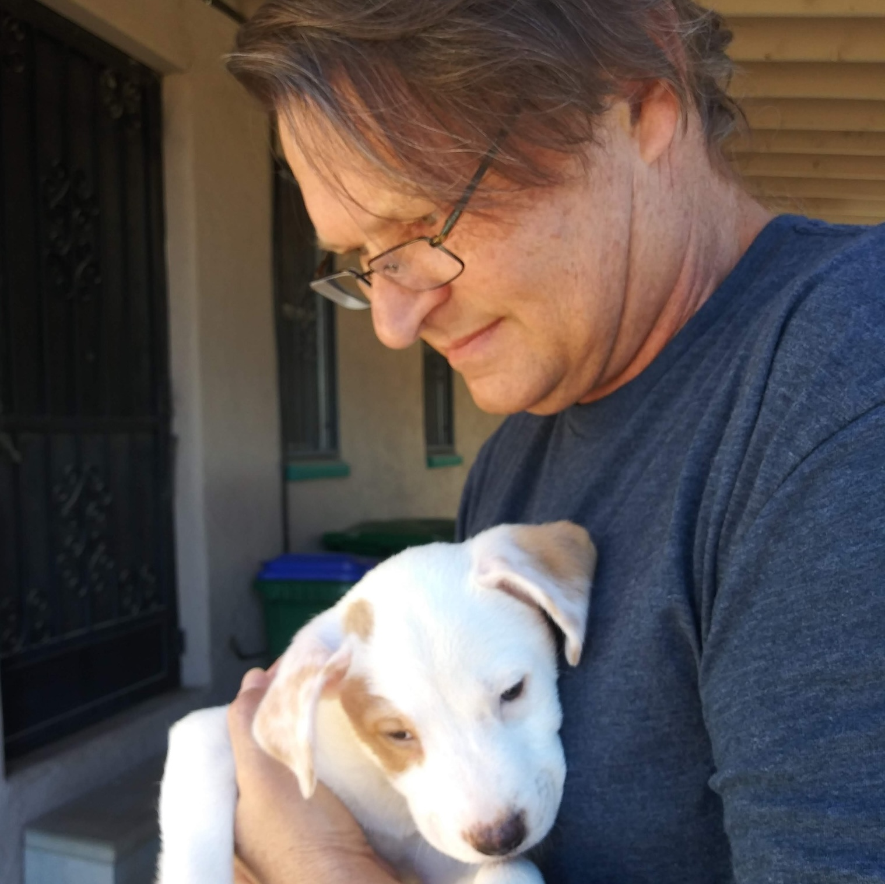

Independent Scholar, Software Engineer.  John has worked as the technical lead for [the Coeur d'Alene Online Language Resource Center](https://thecolrc.org){.external-link target=_blank} for more than 15 years.  Formerly, he designed and built software for scientific discovery at the [University of Arizona's Lunar and Planetary labs](https://www.lpl.arizona.edu/){.external-link target=_blank} for the [Cassini Huygens](https://science.nasa.gov/mission/cassini/){.external-link target=_blank} and [OSIRIS-Rex](https://science.nasa.gov/mission/osiris-rex/){.external-link target=_blank} missions. 

### Melanie McKay Cody

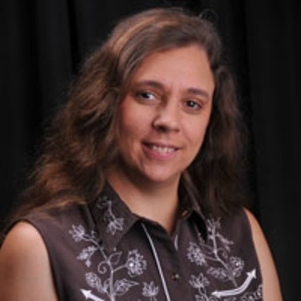

[Assistant Professor, Department of Disability & Psychoeducational Studies, University of Arizona](https://naair.arizona.edu/person/melanie-mckay-cody){.external-link target=_blank}. Melanie (Cherokee Nation; Shawnee Tribe; Powhatan; Montauk Tribe) earned her doctoral degree in linguistic and socio-cultural anthropology at the University of Oklahoma. She has studied critically-endangered Indigenous Sign Languages in North America since 1994 and helps different tribes preserve their tribal signs. 

### Mike Hammond

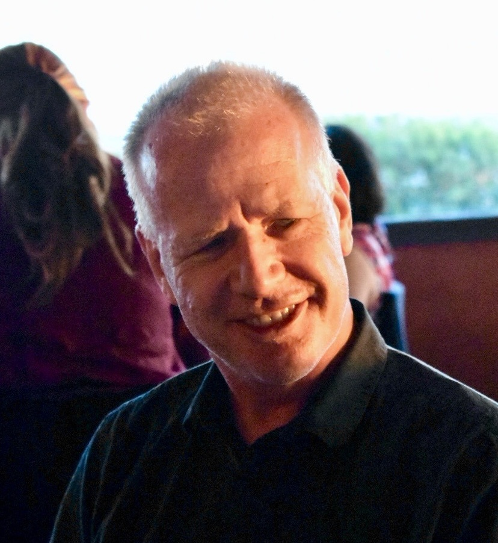

[Professor of Linguistics, University of Arizona](https://hammondm.github.io/){.external-link target=_blank}. Mike is also affiliated with [the Human Language Technology Program](https://linguistics.arizona.edu/ms-hlt){.external-link target=_blank}, [the Cognitive Science Program](https://cogsci.arizona.edu/){.external-link target=_blank}, [the joint Linguistics-Anthropology Ph.D. Program](https://linguistics.arizona.edu/joint-phd-anli){.external-link target=_blank}, and [the Second Language Acquisition and Teaching](https://slat.arizona.edu/) program. history research areas include: phonology, morphology, computational linguistics, English phonology and morphology, poetic meter, psycholinguistics, Welsh, and Scottish Gaelic.

### Ofelia Zepeda

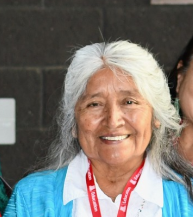

[Regents Professor of Linguistics and Director, American Indian Language Development Institute, University of Arizona](https://aildi.arizona.edu/person/ofelia-zepeda){.external-link target=_blank}. Ofelia (Tohono O'odham) is a Regents' professor of linguistics and affiliate faculty in American Indian Studies at the University of Arizona. She teaches Tohono O'odham language courses and survey courses on American Indian languages. Her research areas include language variation, language policy, and issues of endangered languages. 

### Rolando Coto Solano

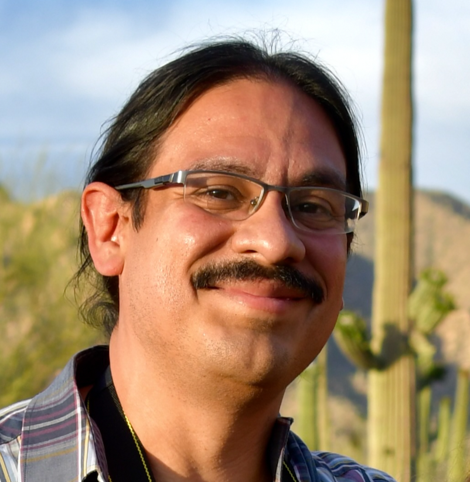

[Assistant Professor, Linguistics, Dartmouth University](https://linguistics.dartmouth.edu/people/rolando-coto-solano){.external-link target=_blank}.  [Rolando](https://www.rolandocoto.com/){.external-link target=_blank} works in natural language processing for Indigenous and under-resourced languages, including speech recognition and automated parsing, and language documentation, revitalization and technology including tonal phonetics and phonology, typologies of tonal reduction, and sociophonetics. He has worked with Chibchan, Otomanguean and Polynesian languages. 

## Graduate Student participants

### Alice Kwak

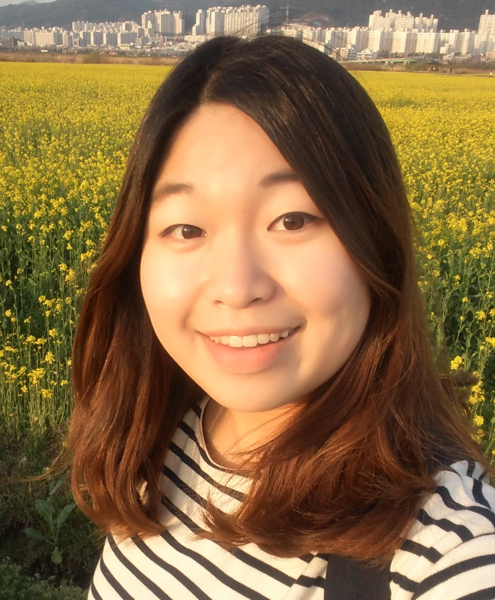

Alice is PhD student in [Linguistics at the University of Arizona](https://linguistics.arizona.edu){.external-link target=_blank} focusing on Human Language Technology and Language Revitalization. Alice has worked for several years on the [Coeur d'Alene Online Language Resource Center](https://thecolrc.org){.external-link target=_blank}, and is developing a morphological parser to support full-text search in that application.

### Jennifer Medina

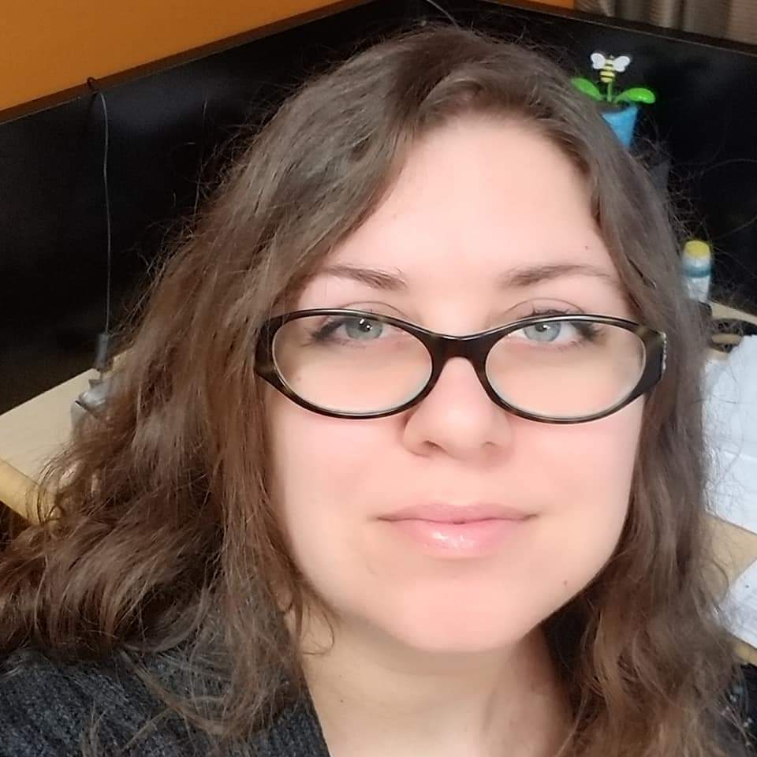

Jennifer is a PhD student [Linguistics at the University of Arizona](https://linguistics.arizona.edu){.external-link target=_blank}, focusing on Human Language Technology and Language Revitalization.  Jennifer has worked for several years on the [Coeur d'Alene Online Language Resource Center](https://thecolrc.org){.external-link target=_blank}, and is developing automatic transliteration to support full-text search in that application.

---

## Acknowledgments

  
  
  
  

We are grateful for financial support from the [Agnese Helms Haury Program in Environment and Social Justice](/){.external-link target=_blank} Award through the University of Arizona [College of Social and Behavioral Sciences](https://sbs.arizona.edu){.external-link target=_blank} and the [National Science Foundation](https://nsf.gov){.external-link target=_blank} Award BCS-2347147.  Our project is housed at [The University of Arizona](https://arizona.edu){.external-link target="_blank"} and [Dartmouth University](https://dartmouth.edu){.external-link target="_blank"}.

