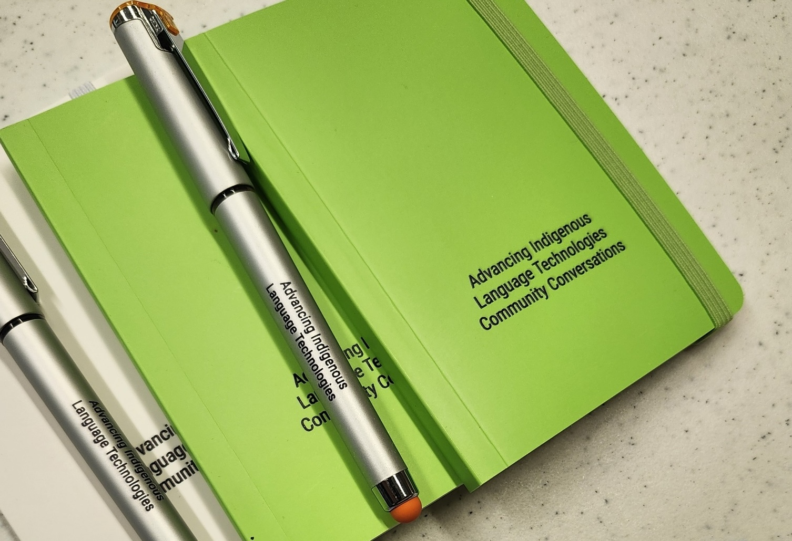

  

We are interested in talking to and working with Indigenous language workers, technology specialists and linguists to support the advancement of Indigenous Language Technologies.

## Our Expertise

AILT members can currently consult on development of the following types of projects. Note that our approach is to **build capacity rather than products**. This means that our approach is to provide Indigenous language communities with support in learning and building technologies that will serve, and be sustainable for, their needs, in their contexts, in ways consistent with their values.  If you're interested, [contact us](./contact.md){.internal-link}!

### Code Your Own

- **Databases**: designing, developing, and implementing databases to support language documentation and application development.

- **Natural Language Processing Techniques**: applying deep learning tools to language documentation and revitalization.

- **Speech Recognition for Indigenous Languages**: developing automatic speech recognition systems for language documentation.

- **Web Applications**: designing, developing and implementing web applications using javascript, docker, hasura, graphQL.

- **Parsing and Grammatical Analysis**:  working with existing text materials to analyze and segment complex words and phrases into their component parts. This can improve the utility of online dictionaries and phrasebooks, for example.

### Learn a Platform

AILT Team members have some experience with the following  platforms and applications that are commonly used in language documentation projects.  AILT is not primarily focused on supporting existing tools, but we may be able to provide some support in the following.

- **Elan**: using [MPI's Elan](https://archive.mpi.nl/tla/elan/){.external-link target="_blank"} software as part of the language documentation and multimedia dictionary development process, and to create audio-video materials with multilingual captioning.

- **Praat**: using [Praat](https://praat.org){.external-link target="_blank"} acoustical analysis software to transcribe and analyze the sounds of spoken languages.

- **SooSL**: using [SIL's SooSL](https://soosl.net/){.external-link target="_blank"} software to develop community dictionaries for Indigenous Signed Languages.

- **FLEx**: using [SIL's FLEx](https://software.sil.org/fieldworks/){.external-link target="_blank"} software as a part of the language documentation and dictionary development process.

- **Keyman**: using [SIL's Keyman](https://keyman.com/){.external-link target="_blank"} to develop customized keyboards and input devices.

We can also assist in selection of platforms and products that are consistent with principles of data sovereignty and application sustainability.

## Future Offerings

We have heard requests for support in creating and maintaining the following kinds of tools:

- **an AILT helpdesk** through which communities and individuals could find and access relevant resources and appropriate experts for language technology projects.
- **keyboards and input devices** for communities who are not comfortable using SIL software.
- **automatic transliteration** many Indigenous languages have been written in multiple orthographies; systems for automatically switching from one writing system to another would be of use and we know of no available applications tailored to this purpose.
- **mobile applications** there are several useful approaches to the development of phone apps that have been successful in communities with whom we have consulted. The AILT community may be able to provide support in this area that our core team cannot (yet).
- **optical character recognition (OCR)** as text materials are digitized to pdf format, they need to be further processed so that the written language can be successfully extracted and used by technical systems.  OCR for English and other majority languages is well-developed, but it is much less accurate for languages written using non-English orthographies.
- **add-ons for commonly used tools such as FLEx and Elan**
there is at least one successful development of an automatic speech-to-text add-on for [Elan](https://archive.mpi.nl/tla/elan/){.external-link target="_blank"}. The AILT community may be able to provide support in this area that our core team cannot. We are not aware of similar efforts for add-ons to [FLEx](https://software.sil.org/fieldworks/){.external-link target="_blank"}.

## Suggest or endorse a tool!

Complete this [short form](https://forms.gle/piYc85kzFSP9bZV5A){.internal-link} and we'll respond to your suggestion as soon as we're able.

## Acknowledgments

  
  
  
  

We are grateful for financial support from the [Agnese Helms Haury Program in Environment and Social Justice](/){.external-link target=\_blank} Award through the University of Arizona [College of Social and Behavioral Sciences](https://sbs.arizona.edu){.external-link target=\_blank} and the [National Science Foundation](https://nsf.gov){.external-link target=\_blank} Award BCS-2347147. Our project is housed at [The University of Arizona](https://arizona.edu){.external-link target="\_blank"} and [Dartmouth University](https://dartmouth.edu){.external-link target="\_blank"}.
