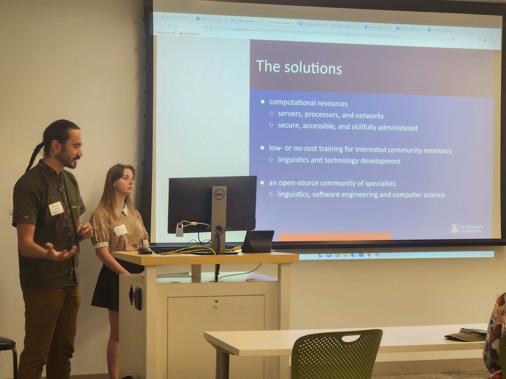

## Introducing AILT: Advancing Indigenous Language Technologies

Braden Thue and Sydney Greenspun, two members of AILT, spoke about our group and our work at the [Arizona Linguistics Circle 18](https://sites.google.com/view/alc-18/home) meeting in October 2025. This is an introduction to what we see as the challenges facing Indigenous language communities today and the kinds of approaches and solutions that we think are best.

	<iframe src="https://arizona.hosted.panopto.com/Panopto/Pages/Embed.aspx?id=21587fa9-cdb2-405b-98d6-b3a101609096&autoplay=false&offerviewer=true&showtitle=false&showbrand=false&captions=true&interactivity=all" style="border: 1px solid #464646; position: absolute; top: 0; left: 0; width: 100%; height: 100%; box-sizing: border-box;" allowfullscreen allow="autoplay" aria-label="Panopto Embedded Video Player" aria-description="Introducing AILT: Advancing indigenous Language Technologies" data-external="1"></iframe>

## Adding Human Languages to Computers and Mobile Devices

The illustrious Craig Cummings, former Unicode Technical Committee Vice Chair, gave a talk on developing keyboards and getting them adopted in an official capacity by the Unicode Consortium.

	<iframe src="https://arizona.hosted.panopto.com/Panopto/Pages/Embed.aspx?id=1735247e-84fd-4ec6-a76d-b36301771a0b&autoplay=false&offerviewer=true&showtitle=true&showbrand=true&captions=false&interactivity=all" style="border: 1px solid #464646; position: absolute; top: 0; left: 0; width: 100%; height: 100%; box-sizing: border-box;" allowfullscreen allow="autoplay" aria-label="Panopto Embedded Video Player" aria-description="AILT-Comms Presentation by Craig Cummings"></iframe>

